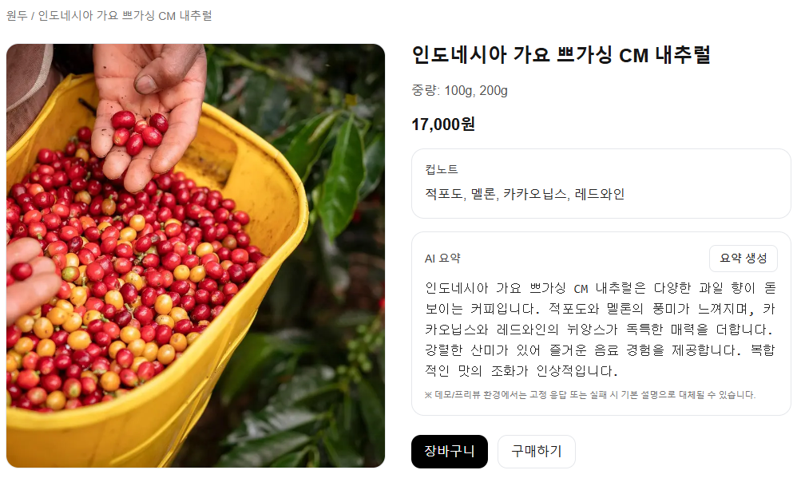

# ☕ AI Coffee Beans Summary Demo

**AI + E-commerce 실험 프로젝트**  

LLM 에 관심이 생겨 공부를 시작하면서 학습용으로 만들었습니다.  
처음에는 단순히 **원두 이름을 입력하면 AI가 요약을 생성하는 도구**로 시작했지만,
이후 확장하여 실제 **상품 상세 페이지**에 붙여보며 실사용이 가능할지를 실험해봤습니다.

> 원두 이름 자체에 **원산지, 품종, 가공 방식** 등 주요 정보가 담겨 있어  
> 이름만으로도 AI가 그럴듯하게 설명을 만들어낼 수 있다는 점에서 아이디어를 얻었습니다 !
---

## 📌 프로젝트 개요

이 프로젝트는 단순한 입력-출력 형태의 AI 실험을 넘어서,  
**전자상거래 환경에서의 AI 활용 가능성**을 보여주는 것을 목표로 했습니다.

- **목적**  
  - LLM(OpenAI API)을 전자상거래 맥락에 적용해  
    소비자 친화적인 상품 설명을 자동 생성하는 기능을 실험  
  - 단순 데모가 아니라 **실제 서비스 플로우**와 유사한 구조 구현
 
- **진행 과정**  
  1. 원두명을 입력하는 간단한 AI 요약기 제작  
  2. `process_phrase`, `variety_phrase` 등 맥락 정보를 추출하도록 서버 라우트 개선  
  3. 원두 상세 페이지를 만들고 AI 요약을 자동으로 붙여 UI에 표시  
  4. 에러 발생 시 기본 설명(fallback) 노출, Grid 기반 반응형 등 실사용 요소 추가  

---

## ✨ 주요 기능

- **상품 상세 페이지**
  - 목업 데이터(`MOCK_BEANS`) 기반 원두 정보 표시
  - 반응형 Grid 레이아웃 적용

- **AI 요약 생성 기능**
  - 상세 페이지 접속 시 자동 실행
  - 버튼 클릭 시 재생성 가능
  - 실패 시 `fallback` 기본 설명 표시
    
- **AI 원두 설명기 (입력형 도구)**
  - 원두명을 직접 입력해 요약 결과 확인 가능
  - 학습 목적의 초기 버전
  
---

## 🛠 기술 스택

- **Frontend**: Next.js (App Router), TypeScript, Tailwind CSS
- **AI/LLM**: OpenAI API (`gpt-4o-mini`)
- **Code Quality**: ESLint, Prettier

---

## 📖 학습/연구 포인트

- **LLM 활용 경험**  
  - OpenAI API를 직접 호출해 프롬프트를 설계  
  - `process_phrase`, `variety_phrase`, `cupnote`를 반영해 자연스러운 설명 생성  
  - 단순 텍스트 출력이 아닌 **맥락 기반 요약 설계** 경험  

- **실전 응용 실험**  
  - 단순 입력창이 아니라 유사하게 구현된 쇼핑몰 상세 페이지에 AI를 붙여봄  
  - 전자상거래에서 **소비자 친화적 설명 보조 기능**의 가능성을 확인  

- **프론트엔드 역량 강화**  
  - `useEffect` + `useCallback`으로 자동 실행 구현
  - 타입 충돌(`params` → Promise) 해결 경험  
  - Tailwind Grid 레이아웃으로 반응형 구현
    
---

## ✨ 스크린샷 / GIF

| 상세 페이지 1 | 상세 페이지 2 |
| --- | --- |
|  |  |

| 에러 시 처리 | 원두 AI 설명기 |
| --- | --- |
|  |
 |

| 상세 페이지 접속 시 AI 요약 자동 실행 |
| --- |
||

| Grid 를 이용한 반응형 처리 |
| --- |

